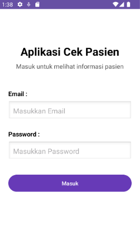
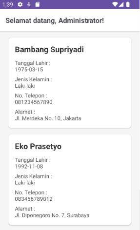

# Aplikasi Pasien

**Aplikasi Pasien** adalah aplikasi Android berbasis Kotlin yang memiliki fitur login menggunakan API dan menampilkan daftar data pasien menggunakan RecyclerView. Aplikasi ini dibuat untuk memenuhi **Tugas 5** mata kuliah **Pemrograman Bergerak**.

## Identitas

| Keterangan | Data |
| :--- | :--- |
| **Nama** | Andra Aufarisque Djayadi |
| **NIM** | F1D02310036 |
| **Kelas** | A |
| **Mata Kuliah** | Pemrograman Bergerak |
| **Tugas** | Tugas 5 - Login API dan Data Pasien |

## Fitur Aplikasi

- **Autentikasi API:** Login menggunakan email dan password melalui server.
- **Validasi Input:** Memastikan field email dan password tidak kosong sebelum mengirim request.
- **Indikator Loading:** Menampilkan *ProgressBar* saat proses autentikasi dan pengambilan data berlangsung.
- **Session Management:** Menyimpan token autentikasi dari response login ke dalam penyimpanan lokal (`SharedPreferences`).
- **Authorization Header:** Mengirimkan token sebagai `Authorization: Bearer {token}` untuk akses data privat.
- **User Branding:** Menampilkan nama pengguna yang sedang login di halaman utama.
- **RecyclerView Pasien:** Menampilkan informasi lengkap pasien (Nama, Tgl Lahir, Gender, Alamat, Telepon) dalam bentuk daftar yang rapi.
- **Desain Modern:** Menggunakan tema visual yang bersih dan profesional.

## Teknologi yang Digunakan

- **Bahasa:** Kotlin
- **UI Framework:** XML Layout & ViewBinding
- **Networking:** Retrofit2
- **JSON Parsing:** Gson Converter
- **Asynchronous Processing:** Kotlin Coroutines & Lifecycle Scope
- **List Handling:** RecyclerView & CardView
- **Local Storage:** SharedPreferences
- **IDE:** Android Studio

## Endpoint API

| Fitur | Method | Endpoint | Keterangan |
| :--- | :--- | :--- | :--- |
| **Login** | `POST` | `https://api.pahrul.my.id/api/login` | Mengirim kredensial untuk mendapatkan token |
| **Data Pasien** | `GET` | `https://api.pahrul.my.id/api/pasien` | Mengambil daftar pasien (Wajib Bearer token) |

## Alur Aplikasi

1. **Halaman Login:** Pengguna memasukkan email dan password di `LoginActivity`.
2. **Request Autentikasi:** Aplikasi mengirim data ke `/api/login` menggunakan `ApiService`.
3. **Penyimpanan Token:** Jika sukses, aplikasi mengekstrak token dan menyimpannya di `SharedPreferences`.
4. **Navigasi:** Pengguna diarahkan ke `MainActivity` (halaman data pasien).
5. **Fetch Data:** Aplikasi memanggil `/api/pasien` dengan menyertakan token di header.
6. **Render UI:** Data pasien yang diterima dipetakan ke dalam `RecyclerView` melalui `PasienAdapter`.

## Struktur Project

```text
com.example.aplikasipasien
├── api
│   ├── ApiService.kt
│   └── RetrofitClient.kt
├── model
│   ├── LoginRequest.kt
│   ├── LoginResponse.kt
│   ├── Pasien.kt
│   └── PasienResponse.kt
└── ui
    ├── LoginActivity.kt
    ├── MainActivity.kt
    └── PasienAdapter.kt
```

## Screenshots
Halaman Login | Daftar Pasien |
| :---: | :---: |
|  |  |
